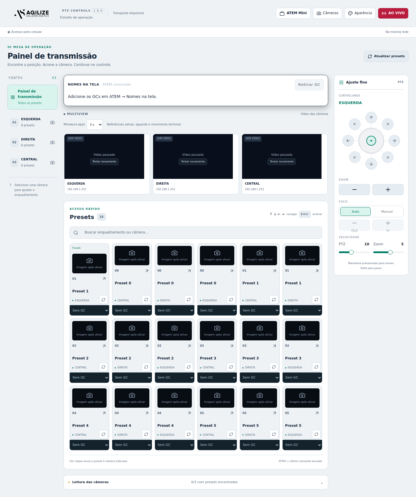
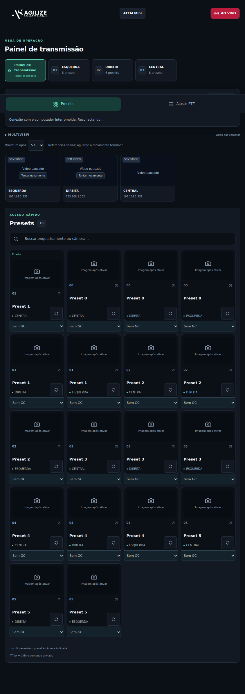

# Agilize PTZ Controls

<picture><source media="(prefers-color-scheme: dark)" srcset="src/renderer/assets/agilize-white.png"></picture>

**Controle PTZ, presets visuais, GCs e transmissão pelo ATEM em uma mesa de operação.**

Desenvolvido por [Agilize Soluções Digitais](https://agilizesolucoesdigitais.com.br), a partir do projeto aberto Panevo. Para eventos, entrevistas, câmaras municipais, aulas e outras produções.

## Download e instalação

Baixe o instalador **Agilize-PTZ-Controls-Setup-1.8.0.exe** nos [Releases](https://github.com/alexmenin/agilize-ptz-controls/releases). Também há um EXE portátil. Não precisa instalar Node.js ou Python para usar o aplicativo.

1. Execute o instalador e abra o Agilize.
2. Em **Câmeras**, cadastre IP, porta e protocolo VISCA. Informe ONVIF e RTSP quando utilizados pela câmera.
3. Importe os presets existentes e confira a lista. Importar não grava posições físicas na câmera; gravar uma posição exige confirmação e pode substituir uma memória existente.
4. Acesse pelo celular usando o endereço exibido no aplicativo, na mesma rede. Mantenha o computador e o Agilize ligados.
5. Adicione o IP do ATEM em **ATEM Mini** e associe cada câmera à sua entrada HDMI.

## Painel de transmissão



- Multiview RTSP e miniatura JPG de referência por preset.
- Um clique ou Enter aciona o preset; as setas apenas navegam, sem movimentar a câmera.
- **Fixar preset:** botão direito no computador ou toque prolongado no celular; escolha Fixar preset. Os fixados ficam no início e são lembrados neste dispositivo/navegador. O mesmo menu permite desafixar. Abrir esse menu não aciona a câmera.
- Celular vertical: **duas colunas**. Horizontal: **até quatro colunas**.
- Faixa de GCs no fluxo da página, sem ficar presa ao topo.
- Logo branca no tema escuro e logo dark no claro.



## GCs e moldura

Use **Adicionar GC**, preencha **Descrição 1** e, se desejar, **Descrição 2**. Os cadastros antigos são preservados. Vincule um GC a um preset; sem vínculo, o preset retira o GC anterior e mantém a moldura.

Em **Cores e logotipos**, escolha cores, PNG junto ao texto e até oito imagens da moldura. Arraste para posicionar; arraste a alça do canto para redimensionar proporcionalmente, ou ajuste largura/altura numericamente. A área do GC permanece reservada.

Salvar envia automaticamente as artes ao ATEM. Atualizações retiram temporariamente o chaveador do ar e restauram a composição ao concluir; a moldura pode desaparecer durante esse envio. Cada GC e a moldura reservam um espaço de mídia. Artes externas são preservadas.

Use saída 1080 HD para GCs. A integração utiliza Media Player 1 e o primeiro chaveador, compartilhado com PiP/chroma. Ao acionar um preset, o corte HDMI/GC espera 1 segundo; esse atraso não confirma a chegada física da PTZ.

## Transmitir pelo ATEM

1. Clique **TRANSMITIR**. Use o destino atual do ATEM ou configure um servidor RTMP/RTMPS, nome do destino, chave e bitrate.
2. O ATEM só informa seu destino atual pela conexão. Para listar as plataformas do ATEM Software Control, importe seu arquivo **Streaming.xml** no próprio diálogo.
3. Clique **Iniciar transmissão**. O botão mostra **AO VIVO** quando o ATEM confirma esse estado. Mudanças feitas no equipamento também são refletidas no app.
4. Clique **AO VIVO** e depois **Confirmar e encerrar no ATEM** para terminar. Cancelar não envia o comando.

Requer modelo com encoder integrado, como ATEM Mini Pro, conexão de internet no ATEM e destino válido. Não transforma um ATEM Mini sem encoder em transmissor. A chave existente permanece oculta; chaves digitadas são enviadas ao ATEM, sem inclusão no arquivo de configuração do Agilize. Use uma rede local confiável; o acesso móvel HTTP não deve ser exposto diretamente à internet.

## Compilar e contribuir

Use Node.js 24 e npm:

```sh
npm ci
node scripts/prepare-preview.cjs
npm start
npm run type
npm test
npm run lint
npm run package -- --platform=win32 --arch=x64
```

O script de preparação baixa go2rtc 1.9.14 do projeto oficial e verifica SHA-256. O executável auxiliar já acompanha o instalador distribuído. Para o portátil, use electron-builder 26.0.12 com o pacote Forge e electron-builder.json; para o instalador, execute NSIS com scripts/windows-installer.nsi. Configurações pessoais, credenciais, caches e builds não pertencem ao repositório.

149 testes automatizados passaram. A interface foi verificada com equipamentos simulados, incluindo fixação, orientação do celular e confirmação de encerramento. Streaming, movimentos PTZ e saída do ATEM precisam de validação nos equipamentos físicos; execução nativa no Windows também não foi testada neste ambiente Linux. Executáveis sem assinatura digital.

## Licença e créditos

Licença MIT, com atribuição original em [LICENSE](LICENSE). Derivado de [Panevo](https://github.com/dutchdronesquad/panevo), Dutch Drone Squad / Klaas Schoute, base v0.1.2. go2rtc de Alexey Khit, MIT; licença em assets/go2rtc/LICENSE. Electron/Chromium e demais dependências mantêm suas licenças. atem-connection e pngjs têm versões registradas no package-lock.json. Integração independente, sem patrocínio ou certificação da Blackmagic Design.

## Linux Mint e Ubuntu (64 bits)

O instalador Linux é `.deb` (DMG é exclusivo do macOS). Baixe
`agilize-ptz-controls_1.8.0_amd64.deb` nos **Releases**, abra o terminal na pasta
do arquivo e instale:

```bash
sudo apt install ./agilize-ptz-controls_1.8.0_amd64.deb
agilize-ptz-controls
```

Também é possível abrir pelo menu de aplicativos. Requer Linux x86-64 com
ambiente gráfico, Ubuntu 22.04 ou posterior / Mint 21 ou posterior. O pacote
inclui Electron e o servidor de preview RTSP. Fechar a janela no Linux encerra
o programa e o acesso pelo celular. Não execute o aplicativo com `sudo`.
O pacote preserva o sandbox e inclui perfil AppArmor específico para Ubuntu
24.04/Mint 22; não desativa a proteção do sistema.

Instalação no equipamento e comunicação real ATEM/PTZ precisam de validação
local. Este é um pacote independente, **não está no repositório oficial Ubuntu
nem em um PPA**. Para remover: `sudo apt remove agilize-ptz-controls`.

Para compilar em Linux x64, com Node.js 22.12+ e `dpkg-deb`:

```bash
npm ci
node scripts/prepare-preview.cjs linux
npm run package -- --platform=linux --arch=x64
node scripts/build-linux-deb.cjs
```

O `.deb` é gerado em `dist/`. Para preparar novamente o preview Windows,
use `node scripts/prepare-preview.cjs win32`.
